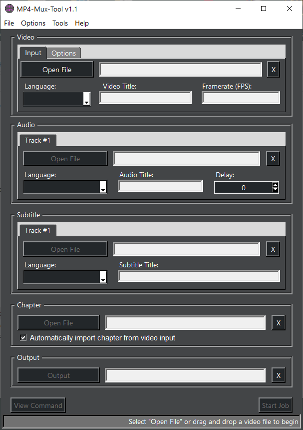

# Mp4-Mux-Tool # 

## Supported Operating Systems ##
Windows 7 **(x64)**, Windows 8 **(x64)**, Windows 10**(x64)**, and Windows 11 **(x64)**

# How to use #
## Main Gui ##
1. Extract program from archive to a folder of your choice or Run program from the archive (if you run from archive the 
program cannot save user settings)
2. Open/Drag and Drop Video Source into Video Input, select optional options
3. Open/Drag and Drop Audio Source into Audio Input, select optional settings - Program supports files with multiple 
audio tracks, you may select which track you want to be added into the final mux via the track selection window
4. Open/Drag and Drop Subtitle source, Chapter Source, etc...
5. Program only needs a video source to mux, you can also drag the same source for both video/audio if you need.
6. Output is automatically defined, the user can however select another location by pressing 'Output' if they desire
7. Press 'Start Job' to begin muxing
8. Selecting 'View Command' will open a small window with the entire command line output being sent to mp4box.exe
9. In 'Options' menu above there is configurable options that are saved when selected, if you have any issues please set 
the 'Shell Options' from 'Progress Bars' to 'Debug' to see what error is provided 

## Guide to building the program yourself: (Windows)
1. Install python x64 3.8.8 (https://www.python.org/ftp/python/3.8.8/python-3.8.8-amd64.exe) 
(This version supports Win7 - 11 x64)
2. Download https://github.com/jlw4049/MP4-Mux-Tool/archive/refs/heads/main.zip and extract 
3. Open command prompt and navigate to where ever you extracted step 2
4. In command prompt type 'pip install -r requirements.txt'
5. Afterwords you can use pyinstaller to make a binary.exe if you'd like with the following command
- 'pyinstaller -F --add-data "\Python\Python38\Lib\site-packages\pymediainfo\MediaInfo.dll";. 
-w --onefile --icon="\MP4-Mux-Tool\Runtime\Images\mp4mux.ico" 
"\MP4-Mux-Tool\Mp4-Mux-Tool.py"' 
NOTE: Program requires DnD module to be installed correctly into the python folders via this method
- You'll need to manually add TkinterDND for the program to function correctly (Tkinter does not natively support drag and drop)
- You'll need two files https://github.com/petasis/tkdnd/releases (tkdnd-X.X.X-windows-x86.zip)
) and https://sourceforge.net/projects/tkinterdnd/files/latest/download
- You need to place `tkdnd2.9.2` folder in **BOTH** `C:\Users\USERNAME\AppData\Local\Programs\Python\Python38-32\tcl` 
and `C:\Users\USERNAME\AppData\Local\Programs\Python\Python38-32\tcl\tcl8.6` directories
- For the second file you downloaded you'll want to place the folder `TkinterDnD2` in directory 
`C:\Users\USERNAME\AppData\Local\Programs\Python\Python38-32\Lib\site-packages`
6. Then you can place .exe alongside of the runtime/apps folder then you're good to go
